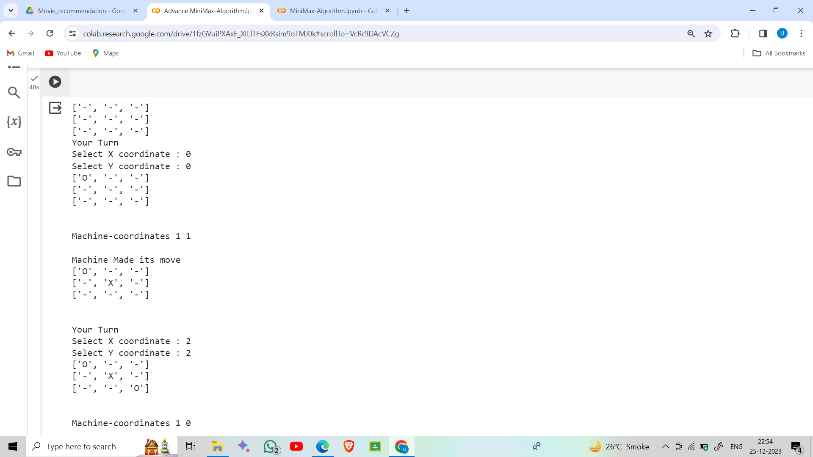
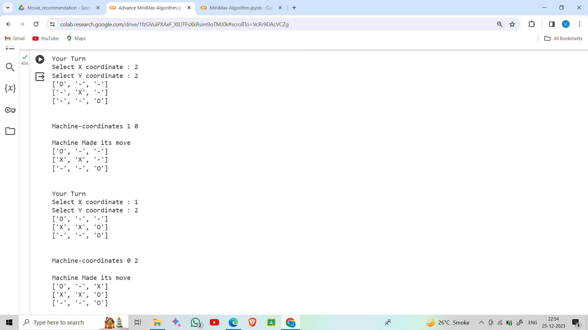
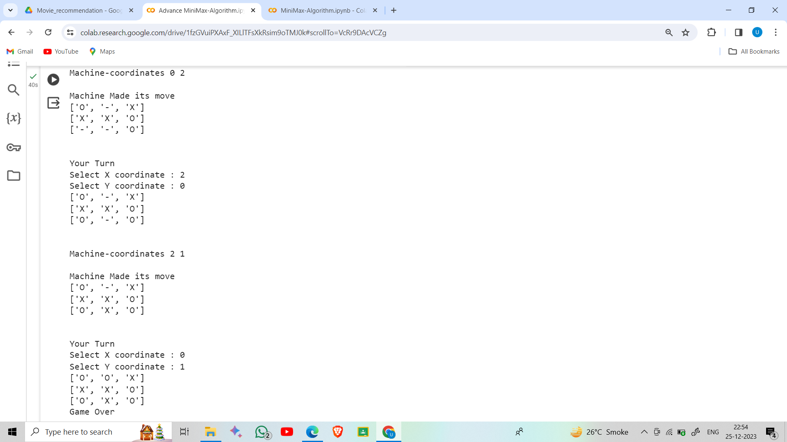
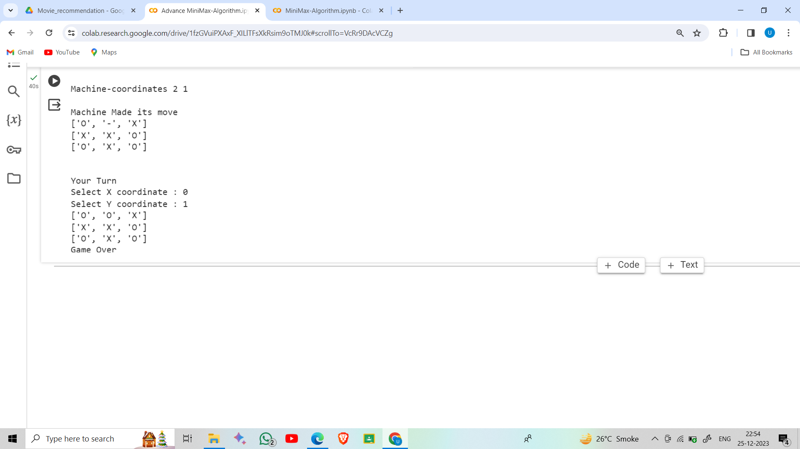

# Tic Tac Toe using Minimax Algorithm
A Tic-Tac-Toe game using the Minimax Algorithm was implemented.

### The game is implemented using the following functions
1. win(board,player) :Takes the current board and checks if the specified player(0-user and 1-machine) has won(True-won, False:lose) 
2. stop(board): Game-stopping Function (checking if there are no blank spaces). If the Game is Over(no more blank spaces ) ‘True’ is returned
3. userturn(board): Handles the turn of the user (Makes necessary changes on the board)
4. minimax(board,player): Actual Minimax Algorithm function
5. best(entries): Function that selects the best position from the available positions based on their minimax values
6. imediate_loose(board): Function for getting the coordinates which will lead to the user win in next immediate step
7. print_board(board): Function for printing the game board.

### Following are some additional changes that were made
1. The Minimax algorithm faces a small difficulty :
  - If for all the empty positions the value is either neutral or all failure(-1) then it can allow the player to win immediately
  - So in the advanced version, the best() function is modified and the immediate_loss() function is introduced to stretch the match and avoid immediate failure
2. random.shuffle() is used to shuffle the outcome given by the best() function.So if there are multiple locations of the same minimax values then we can get some different moves from the machine even if the player makes the same move in multiple games.

### Following are the images

